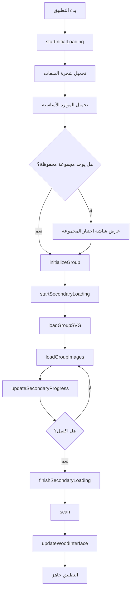

# 📚 خريطة المنهج الطبي التفاعلية (Interactive Medical Curriculum Map)

هذا المشروع يوفر عرضًا تفاعليًا ومبسطًا للمسار التعليمي والملفات الدراسية لمجموعة من الوحدات الطبية (مثل CVS و RRS). يهدف هذا العرض إلى مساعدة الطلاب في تنظيم موادهم والوصول السريع إلى الملفات والمحاضرات الرئيسية.

## ✨ المميزات الرئيسية

* **تأثير التكبير/التوهج:** عند وضع مؤشر الماوس على أي مستطيل، يتم تكبير الجزء المعني من الخريطة مع إضاءة ديناميكية لتمييز المنطقة.
* **وصول مباشر للمحتوى:** النقر على أي منطقة تفاعلية يفتح ملف PDF أو رابط الفيديو المرتبط بها مباشرة.
* **نظام تحميل ذكي:** شاشتين منفصلتين للتحميل (أولي وثانوي) مع مؤشرات تقدم بصرية.
* **ترخيص MIT:** الكود مفتوح المصدر بالكامل، ومتاح للنسخ والاستخدام والتعديل.

---

## 🚀 كيفية تشغيل المشروع

لتشغيل هذا المشروع، لا تحتاج إلى أي أدوات برمجية معقدة. يكفي متصفح ويب حديث.

### 1. 📥 تحميل المشروع

**الطريقة الأولى: تحميل مباشر (مُوصى بها)**

[](https://github.com/MUE24Med/semester-3/archive/refs/heads/main.zip)

**الطريقة الثانية: باستخدام Git**

```bash
git clone https://github.com/MUE24Med/semester-3.git
cd semester-3
```

### 2. 📂 هيكل المجلدات

```
semester-3/
│
├── index.html          # الصفحة الرئيسية
├── script.js           # جافاسكريبت الرئيسي
├── style.css           # ملف التنسيق
├── sw.js              # Service Worker للعمل بدون إنترنت
│
├── groups/            # ملفات SVG للمجموعات
│   ├── group-A.svg
│   ├── group-B.svg
│   └── ...
│
└── image/             # الصور والشعارات
    ├── wood.webp
    ├── logo-A.webp
    └── ...
```

### 3. 🎨 دليل الألوان

* 🔴 `.q { stroke: red; }`         → أسئلة
* 🔵 `.v { stroke: blue; }`        → فيديو شرح
* ⚪️ `.i { stroke: white; }`      → مواد أخرى
* 🟣 `.a { stroke: purple; }`      → إجابات
* 🟢 `.s { stroke: green; }`       → سكشن العملي
* 🟡 `.l { stroke: yellow; }`      → محاضرات
* 🟡🟢`.is{ stroke: Light lemon; }` → ليموني فاتح

### 4. ▶️ التشغيل

1. فك ضغط الملف المُحمّل
2. افتح ملف **`index.html`** باستخدام أي متصفح ويب حديث (Chrome, Firefox, Edge)
3. اختر مجموعتك وابدأ التصفح!

**⚠️ ملاحظة هامة:** 
إذا واجهت مشكلة في فتح أي ملف، تأكد من أن صاحب الملف قد قام بتفعيل خاصية **"المشاركة العامة (Anyone with the link)"** على Google Drive.

---

## 📖 فهرس دوال جافاسكربت (JavaScript Functions Index)

### 🔧 دوال نظام التحميل (Loading System)

| الرقم | اسم الدالة | الوصف |
|------|------------|-------|
| **[01]** | `startInitialLoading()` | بدء التحميل الأولي (قبل اختيار الجروب) |
| **[02]** | `updateInitialProgress(circle, text)` | تحديث دائرة التقدم للتحميل الأولي |
| **[03]** | `loadInitialResources(circle, text)` | تحميل الموارد الأساسية (صور + خشب) |
| **[04]** | `startSecondaryLoading(groupLetter)` | التحميل الثانوي (بعد اختيار الجروب) |
| **[05]** | `loadGroupSVG(groupLetter)` | تحميل ملف SVG الخاص بالمجموعة |
| **[06]** | `loadGroupImages()` | تحميل صور المجموعة بالتوازي |
| **[07]** | `updateSecondaryProgress()` | تحديث المصابيح حسب نسبة التحميل |
| **[08]** | `finishSecondaryLoading()` | إنهاء التحميل وعرض الواجهة |

### 🌳 دوال البيانات والملفات (Data & Files)

| الرقم | اسم الدالة | الوصف |
|------|------------|-------|
| **[09]** | `fetchGlobalTree()` | جلب شجرة الملفات من GitHub API |
| **[10]** | `smartOpen(item)` | فتح الملفات (PDF) بذكاء مع التحقق |

### 🎯 دوال التهيئة الرئيسية (Core Initialization)

| الرقم | اسم الدالة | الوصف |
|------|------------|-------|
| **[11]** | `initializeGroup(groupLetter)` | **الدالة الأم** - تهيئة المجموعة بالكامل |

### 📱 دوال التنقل والتاريخ (Navigation & History)

| الرقم | اسم الدالة | الوصف |
|------|------------|-------|
| **[12]** | `pushNavigationState(state, data)` | إضافة حالة للتاريخ |
| **[13]** | `popNavigationState()` | إزالة آخر حالة من التاريخ |
| **[14]** | `getCurrentNavigationState()` | الحصول على الحالة الحالية |
| **[15]** | `handleBackNavigation(e)` | معالجة زر الرجوع |
| **[16]** | `setupBackButton()` | إعداد نظام التنقل الخلفي |

### 🔤 دوال معالجة النصوص (Text Processing)

| الرقم | اسم الدالة | الوصف |
|------|------------|-------|
| **[17]** | `normalizeArabic(text)` | تطبيع النص العربي (إزالة التشكيل) |
| **[18]** | `autoTranslate(filename)` | ترجمة تلقائية من إنجليزي لعربي |
| **[19]** | `getDisplayName()` | الحصول على اسم المستخدم المحفوظ |

### 🗺️ دوال التنقل في الخريطة (Map Navigation)

| الرقم | اسم الدالة | الوصف |
|------|------------|-------|
| **[20]** | `goToWood()` | الانتقال إلى بداية الخريطة (الخشب) |
| **[21]** | `goToMapEnd()` | الانتقال إلى نهاية الخريطة |

### 📐 دوال الحجم والتخطيط (Layout & Sizing)

| الرقم | اسم الدالة | الوصف |
|------|------------|-------|
| **[22]** | `updateDynamicSizes()` | ضبط أبعاد ViewBox ديناميكياً |

### ✨ دوال التأثيرات البصرية (Visual Effects)

| الرقم | اسم الدالة | الوصف |
|------|------------|-------|
| **[23]** | `getCumulativeTranslate(element)` | حساب الإزاحة التراكمية |
| **[24]** | `getGroupImage(element)` | الحصول على صورة المجموعة |
| **[25]** | `cleanupHover()` | إزالة تأثيرات الهوفر |
| **[26]** | `startHover()` | تطبيق التكبير والإضاءة عند الهوفر |

### 📝 دوال النصوص والتسميات (Text & Labels)

| الرقم | اسم الدالة | الوصف |
|------|------------|-------|
| **[27]** | `wrapText(el, maxW)` | معالجة النصوص الطويلة |
| **[28]** | `updateWoodLogo(groupLetter)` | تحديث شعار المجموعة |
| **[29]** | `renderNameInput()` | عرض حقل إدخال الاسم |

### 🪵 دوال واجهة الخشب (Wood Interface)

| الرقم | اسم الدالة | الوصف |
|------|------------|-------|
| **[30]** | `updateWoodInterface()` | **الأهم** - بناء القوائم والبحث والتمرير |

### 🔍 دوال معالجة المستطيلات (Rectangle Processing)

| الرقم | اسم الدالة | الوصف |
|------|------------|-------|
| **[31]** | `processRect(r)` | معالجة مستطيل واحد (تسميات + أحداث) |
| **[32]** | `scan()` | فحص ومعالجة جميع المستطيلات |

### 🛠️ دوال الأدوات المساعدة (Utilities)

| الرقم | اسم الدالة | الوصف |
|------|------------|-------|
| **[33]** | `debounce(func, delay)` | تأخير التنفيذ لتحسين الأداء |
| **[34]** | `setupClearCacheButton()` | إعداد زر مسح الكاش |
| **[35]** | `setupGroupButtons()` | إعداد أزرار اختيار الجروب |
| **[36]** | `setupControlButtons()` | إعداد أزرار التحكم |
| **[37]** | `setupSearch()` | إعداد نظام البحث |

---

## 🔄 سير عمل التطبيق (Application Flow)



---

## 🎯 الدوال الأساسية (Core Functions)

### 1️⃣ دورة حياة التطبيق الكاملة

```javascript
window.addEventListener('load', () => {
    // إنشاء معرف الزائر
    if (!localStorage.getItem('visitor_id')) {
        const newId = 'ID-' + Math.floor(1000 + Math.random() * 9000);
        localStorage.setItem('visitor_id', newId);
    }
    
    setupGroupButtons();       // [35]
    setupClearCacheButton();   // [34]
    setupControlButtons();     // [36]
    setupSearch();             // [37]
    setupBackButton();         // [16]
    
    const savedGroup = localStorage.getItem('selectedGroup');
    
    if (savedGroup) {
        startInitialLoading().then(() => {  // [01]
            initializeGroup(savedGroup);     // [11]
        });
    } else {
        startInitialLoading();  // [01]
    }
});
```

### 2️⃣ دالة التهيئة الرئيسية

```javascript
// [11] initializeGroup(groupLetter)
async function initializeGroup(groupLetter) {
    currentGroup = groupLetter;
    localStorage.setItem('selectedGroup', groupLetter);
    
    pushNavigationState(NAV_STATE.WOOD_VIEW);  // [12]
    await startSecondaryLoading(groupLetter);   // [04]
}
```

### 3️⃣ دالة بناء الواجهة الذكية

```javascript
// [30] updateWoodInterface()
// ✅ بناء قوائم الملفات والمجلدات
// ✅ البحث الذكي (عربي/إنجليزي)
// ✅ التمرير المحسن مع القصور الذاتي
// ✅ الفواصل بين المواد
// ✅ العد التلقائي للملفات
```

---

## 📜 الترخيص

هذا المشروع مرخص بموجب ترخيص **MIT License**.

```
MIT License

Copyright (c) 2025 MUE24Med

Permission is hereby granted, free of charge, to any person obtaining a copy
of this software and associated documentation files (the "Software"), to deal
in the Software without restriction, including without limitation the rights
to use, copy, modify, merge, publish, distribute, sublicense, and/or sell
copies of the Software, and to permit persons to whom the Software is
furnished to do so, subject to the following conditions:

The above copyright notice and this permission notice shall be included in all
copies or substantial portions of the Software.

THE SOFTWARE IS PROVIDED "AS IS", WITHOUT WARRANTY OF ANY KIND, EXPRESS OR
IMPLIED, INCLUDING BUT NOT LIMITED TO THE WARRANTIES OF MERCHANTABILITY,
FITNESS FOR A PARTICULAR PURPOSE AND NONINFRINGEMENT. IN NO EVENT SHALL THE
AUTHORS OR COPYRIGHT HOLDERS BE LIABLE FOR ANY CLAIM, DAMAGES OR OTHER
LIABILITY, WHETHER IN AN ACTION OF CONTRACT, TORT OR OTHERWISE, ARISING FROM,
OUT OF OR IN CONNECTION WITH THE SOFTWARE OR THE USE OR OTHER DEALINGS IN THE
SOFTWARE.
```

---

## 🤝 المساهمة

نرحب بالمساهمات! إذا كنت تريد تحسين المشروع:

1. Fork المشروع
2. أنشئ فرع للميزة الجديدة (`git checkout -b feature/AmazingFeature`)
3. Commit التغييرات (`git commit -m 'Add some AmazingFeature'`)
4. Push للفرع (`git push origin feature/AmazingFeature`)
5. افتح Pull Request

---

## 📞 الدعم

إذا واجهت أي مشكلة، يمكنك:

- فتح [Issue جديد](https://github.com/MUE24Med/semester-3/issues)
- التواصل عبر البريد الإلكتروني: **dr.george.r.n@gmail.com**
- أو الهاتف: **01556081322**

---

## 🌟 شكر خاص

شكراً لكل من ساهم في تطوير هذا المشروع وجعله أفضل! 💙

---

**صُنع بـ ❤️ من أجل طلاب الطب**